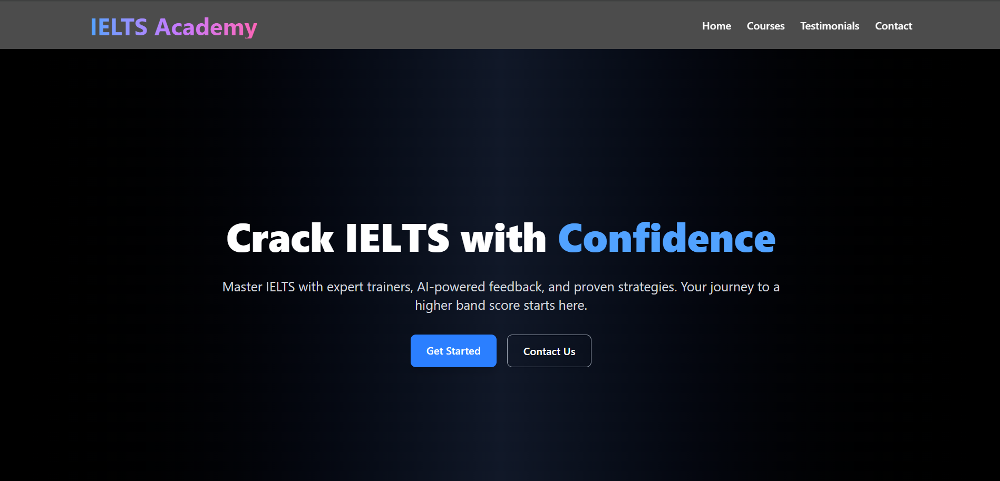
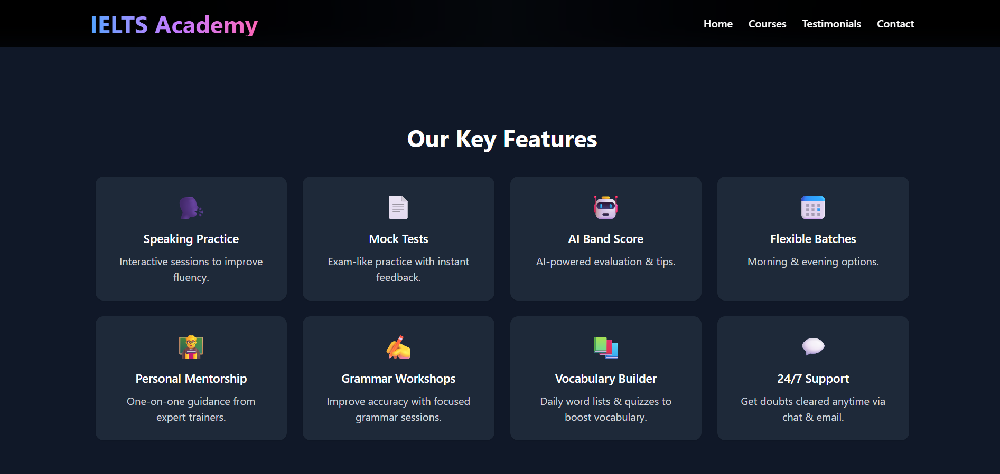
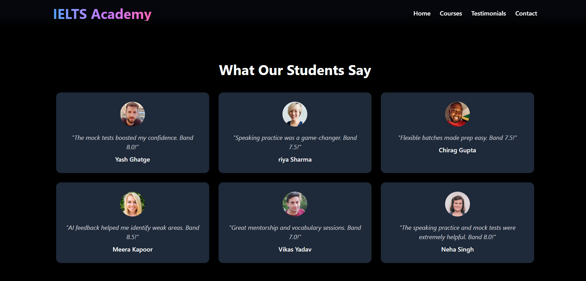

# IELTS Institute Homepage (React + Tailwind)

A modern and responsive homepage for a fictional IELTS Institute.

## 🚀 Features
- Responsive Navbar with mobile menu
- Hero section with headline, subtext, button, and image
- 8 Feature cards (Speaking Practice, Mock Tests, AI Band Score, Flexible Batches etc)
- Student testimonials section
- Footer with contact info and links

## 🛠️ Tech Stack
- React.js
- TailwindCSS

## 🖼 Screenshots

| **Hero** | **Features** |
|-------------|---------------|
|  |  |

| **Testimonials** | 
|-----------------|----------------|
|  | 

## 📦 Setup
```bash
git clone https://github.com/Yash-Ghatge/Assignment.git
cd Frontend
npm install
npm start
